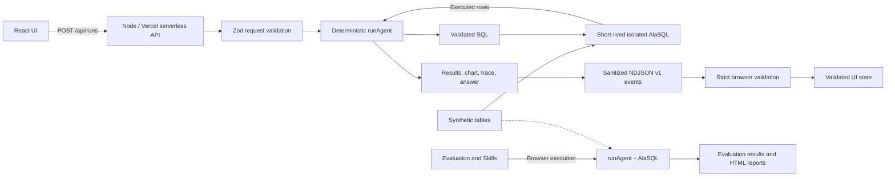
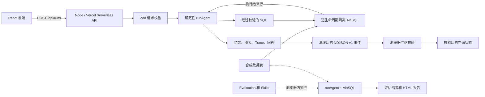

# BI Data Agent Sandbox

A public, runnable BI data-agent demo built with synthetic data and deterministic workflows.

[Live demo](https://data-agent-sandbox.vercel.app/) | [Agent showcase](https://data-agent-sandbox.vercel.app/showcase?view=agent) | [Guardrail showcase](https://data-agent-sandbox.vercel.app/showcase?view=guardrail) | [Evaluation showcase](https://data-agent-sandbox.vercel.app/showcase?view=evaluation)

## What This Project Is

BI Data Agent Sandbox demonstrates how a small data agent turns a natural-language business question into an intent, selected metrics and tables, validated read-only SQL, executed results, a chart, a grounded answer, and a reviewable trace.

It is a hybrid frontend and serverless application. Interactive runs use a real same-origin API and real SQL execution over synthetic ecommerce data. There is no artificial delay and no precomputed result pretending to be a run; the displayed timing comes from the work performed for that request.

## Why It Exists

The project answers one practical question: **does the agent actually work?** A user can submit a prepared or supported question and inspect the complete path from request to SQL, validation, result rows, chart, answer, and trace. Deterministic contracts make that path runnable without an LLM API key and testable before any optional model integration is added.

## What Works Today

- Two executable topics: `retail-growth-demo` and `experiment-metrics-demo`, with ten prepared business questions in total.
- Interactive Topic runs, Quick Demo, Agent Showcase, and Guardrail Showcase call `POST /api/runs`.
- The production API is a Node/Vercel serverless function that validates requests with Zod and streams NDJSON v1 events using transport ID `ndjson-v1`.
- `runAgent` deterministically routes intent, selects metric and schema context, generates and validates read-only SQL, creates an isolated AlaSQL database, executes against synthetic data, and builds charts, grounded answers, warnings, guardrail decisions, and trace steps.
- Sensitive user-level export requests are blocked before SQL execution. Unsupported questions return a needs-review outcome rather than invented SQL.
- The browser validates the response media type, transport ID, run identity, event order, response bounds, streamed-to-terminal trace parity, and terminal outcome integrity before exposing completion.
- Evaluation runs versioned regression testsets through the deterministic agent in the browser and applies deterministic scoring. Bad Case Review Queue state remains in browser memory and is not persisted.
- Skills run in the browser and can generate, edit, preview in a sandboxed iframe, and download a self-contained HTML report.
- `knowledge-base-demo` describes public metadata and governance guidance but is not executable yet.
- GitHub Actions runs install, typecheck, tests, lint, and build on pushes to `main` and pull requests.

No LLM key, authentication, persistent database, saved run history, external warehouse, upload pipeline, or third-party data/model API is required or implemented today.

## Architecture



The React/Vite/TypeScript UI uses Recharts for visualizations. In production, Vercel serves the static app and the Node function at `/api/runs`. During `npm run dev` and `npm run preview`, a Vite plugin mounts the same handler as a local API adapter, so one command serves both the UI and API path.

The API sanitizes unexpected failures and SQL execution errors before returning them. API responses enforce no-store, same-origin resource policy, and content-type protection. The site also enforces additional browser security headers. A strict Content Security Policy is currently report-only because browser-side AlaSQL used by Evaluation and Skills relies on dynamic compilation; enforcing it is a roadmap item after those paths move to the backend.

Detailed design: [English architecture](docs/architecture.en.md) | [中文架构](docs/architecture.zh.md)

## How to Run Locally

Node.js 24 is recommended. No `.env` file or API key is needed.

```bash
npm ci
npm run dev
```

Vite prints the local URL. The same process serves the frontend and the local `/api/runs` adapter.

Run the quality gates:

```bash
npm run typecheck
npm run test
npm run test:contract
npm run lint
npm run build
```

Inspect the production build locally:

```bash
npm run preview
```

`npm run test:contract` is an in-process contract test. It exercises the production client module and NDJSON parser directly against the real API handler for successful, blocked, and needs-review scenarios; it does not launch a browser or HTTP server. `npm run preview` serves the production build together with the local API adapter.

## Confidentiality Boundary

**This project uses synthetic or public data only. It does not contain internal company data, code, prompts, schemas, screenshots, business metrics, roadmap details, or proprietary workflows.**

All topic names, questions, metric definitions, data, UI content, serverless code, and workflow contracts in this repository are public demo material created for this sandbox.

See [Confidentiality Boundary](docs/confidentiality.en.md).

## Roadmap

- Move Evaluation and Skills execution to the backend, then enforce the strict Content Security Policy.
- Add an optional LLM provider behind the deterministic contracts while keeping the no-key path fully runnable.
- Add durable run history, evaluation artifacts, and report versions.
- Add production authentication, distributed rate limiting, and observability.
- Add connectors for public datasets only, keeping this sandbox synthetic-or-public-data-only.
- Make long-running execution asynchronous and preemptible so cancellation can stop server computation.
- Split the frontend bundle into smaller route and feature chunks.

---

# BI Data Agent Sandbox 中文说明

[在线演示](https://data-agent-sandbox.vercel.app/) | [Agent 演示](https://data-agent-sandbox.vercel.app/showcase?view=agent) | [Guardrail 演示](https://data-agent-sandbox.vercel.app/showcase?view=guardrail) | [Evaluation 演示](https://data-agent-sandbox.vercel.app/showcase?view=evaluation)

## 项目简介

BI Data Agent Sandbox 是一个公开、可运行的 BI 数据 Agent 演示项目。它展示一个小型数据 Agent 如何把自然语言业务问题转换为意图、指标和数据表选择、经过校验的只读 SQL、执行结果、图表、有依据的回答，以及可审查的 Trace。

项目采用前端加 Serverless 后端的混合架构。交互式运行会真正调用同源 API，并在合成电商数据上执行 SQL。项目不会人为等待来制造过程感，也不会拿预先写好的结果冒充一次运行；界面显示的时间来自该次请求实际完成的工作。

## 为什么要做

这个项目回答一个实际问题：**这个 Agent 到底能不能工作？** 用户可以提交准备好的问题或已支持的问题，并查看从请求、SQL、校验到结果行、图表、回答和 Trace 的完整过程。确定性契约使这条链路不依赖 LLM API key，也能在接入任何可选模型前持续测试。

## 当前可运行能力

- 两个可执行 Topic：`retail-growth-demo` 和 `experiment-metrics-demo`，合计十个准备好的业务问题。
- Topic 运行、Quick Demo、Agent Showcase 和 Guardrail Showcase 都会调用 `POST /api/runs`。
- 线上 API 是 Node/Vercel Serverless Function，使用 Zod 校验请求，并通过 `ndjson-v1` Transport 流式返回 NDJSON v1 事件。
- `runAgent` 以确定性方式完成意图路由、指标和 Schema 选择、只读 SQL 生成与校验、隔离的 AlaSQL 数据库执行，以及图表、回答、Warnings、Guardrail Decision 和 Trace 生成。
- 用户级敏感导出请求会在 SQL 执行前被阻断；暂不支持的问题会进入 needs-review，而不是编造 SQL。
- 浏览器在展示完成状态前，会校验响应类型、传输协议、Run ID、事件顺序、大小边界、流式 Trace 与终态 Trace 的一致性，以及最终结果的完整性。
- Evaluation 在浏览器中用版本化测试集运行确定性 Agent，并进行确定性评分。Bad Case Review Queue 只保存在浏览器状态中，不会持久化。
- Skills 仍在浏览器中运行，可生成、编辑、在沙箱 iframe 中预览并下载独立 HTML 报告。
- `knowledge-base-demo` 当前只展示公开元数据和治理说明，尚不能执行检索问答。
- GitHub Actions 会在推送到 `main` 或创建 Pull Request 时自动执行安装、类型检查、测试、Lint 和构建。

当前不需要也没有实现 LLM key、登录鉴权、持久化数据库、运行历史、外部数仓、上传流程或第三方数据/模型 API。

## 系统架构



前端使用 React、Vite、TypeScript 和 Recharts。线上由 Vercel 托管静态页面，并在 `/api/runs` 提供 Node Serverless Function。本地运行 `npm run dev` 或 `npm run preview` 时，Vite 插件会挂载同一个 Handler 作为本地 API Adapter，因此一个命令就能同时提供前端和 API 路径。

API 会在返回前清理意外错误和 SQL 执行错误。API 响应强制使用 no-store、同源资源策略和内容类型保护，站点还启用了其他浏览器安全响应头。由于 Evaluation 和 Skills 的浏览器端 AlaSQL 依赖动态编译，严格 CSP 目前只处于 Report-Only 模式；等这两条执行路径迁到后端后再正式强制启用。

详细设计：[中文架构](docs/architecture.zh.md) | [English architecture](docs/architecture.en.md)

## 本地运行

建议使用 Node.js 24。不需要 `.env` 文件，也不需要 API key。

```bash
npm ci
npm run dev
```

Vite 会输出本地访问地址。同一个进程同时提供前端和本地 `/api/runs` Adapter。

运行质量检查：

```bash
npm run typecheck
npm run test
npm run test:contract
npm run lint
npm run build
```

在本地检查生产构建：

```bash
npm run preview
```

`npm run test:contract` 是进程内契约测试：它让生产客户端模块和 NDJSON Parser 直接经过真实 API Handler，覆盖成功、阻断和 needs-review 场景，但不会启动浏览器或 HTTP Server。`npm run preview` 会同时提供生产构建产物和本地 API Adapter。

## 保密边界

**本项目只使用合成数据或公开数据。项目不包含任何公司内部数据、代码、提示词、Schema、截图、业务指标、路线图细节或专有工作流。**

本仓库中的 Topic 名称、问题、指标定义、数据、界面内容、Serverless 代码和工作流契约，都是专门为这个公开 Sandbox 创建的演示材料。

详见[保密边界](docs/confidentiality.zh.md)。

## 路线图

- 将 Evaluation 和 Skills 的执行迁到后端，然后正式强制启用严格 CSP。
- 在确定性契约后增加可选 LLM Provider，同时保证无 Key 模式始终可以运行。
- 增加可持久化的运行历史、评估产物和报告版本。
- 增加生产级鉴权、分布式限流和可观测性。
- 后续只增加面向公开数据集的 Connector，保证本 Sandbox 始终只使用合成数据或公开数据。
- 将长任务改为异步、可抢占执行，让取消操作真正停止服务端计算。
- 按路由和功能拆分前端 Bundle。
