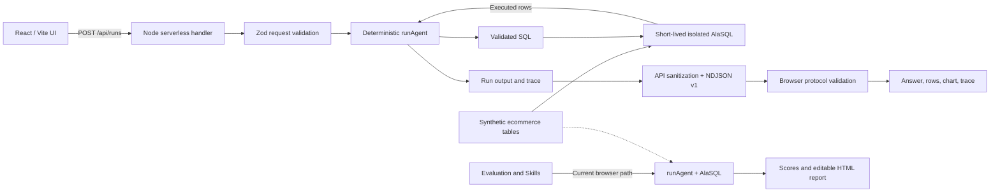

# Architecture

BI Data Agent Sandbox is a hybrid React frontend and Node serverless application. It uses only repository-owned synthetic data and deterministic workflows. The interactive path is a real request/response flow; Evaluation and Skills currently reuse the same agent core in the browser.

## Runtime Topology

Production uses Vercel static hosting for the frontend and `api/runs.ts` as the Node serverless function. Vercel rewrites application routes, including `/showcase`, to the SPA while the API function remains available at `/api/runs`.

For local development and preview, `src/dev/runApiMiddleware.ts` adapts the same Fetch-style handler to Vite's HTTP server. `vite.config.ts` installs it for both `npm run dev` and `npm run preview`. One Vite process therefore serves the UI and local API adapter.

## Interactive Run Path

These surfaces call `POST /api/runs` through `src/agent/agentClient.ts`:

- Topic execution on the Retail Growth Demo and Experiment Metrics Demo pages.
- Quick Demo on the Overview page.
- `/showcase?view=agent`.
- `/showcase?view=guardrail`.

`api/_runRequest.ts` accepts JSON only, limits the request body to 8 KiB, limits the trimmed question to 500 characters, rejects unknown fields, and allows only the two executable topic IDs.

`api/runs.ts` assigns a server-generated run ID, invokes `runAgent`, streams versioned events, and sanitizes unexpected failures and SQL execution errors. The transport is `application/x-ndjson` with `X-Agent-Transport: ndjson-v1` and `X-Run-Id` response headers.

The event order is:

1. `run.started`
2. Zero or more `step.completed` events
3. Exactly one `run.completed` or `run.failed` terminal event

There is no artificial waiting. Timings are measured while the deterministic work runs, so fast runs may complete quickly.

## Deterministic Agent Core

`src/agent/runAgent.ts` orchestrates the shared core:

- `intentRouter.ts` classifies supported business questions, unknown questions, and sensitive requests.
- `metricCatalog.ts` and `schema.ts` provide the public semantic context used during execution.
- `sqlGenerator.ts` selects deterministic, read-only SQL templates for supported intents.
- `sqlValidator.ts` checks statement shape, known tables and columns, date filters, explicit projections, and sensitive fields before execution.
- `sqlExecutor.ts` creates a unique in-memory AlaSQL database for each run, registers copied synthetic tables, executes validated statements, and removes the database afterward.
- `chartSpec.ts`, `answerGenerator.ts`, and `trace.ts` build chart data, a result-grounded answer, warnings, guardrail decisions, follow-ups, and reviewable trace steps.

The core has no model call, network data source, or API-key requirement. Optional LLM support is not implemented.

`src/agent/knowledgeBase.ts` and `knowledge-base-demo` contain static public metadata. `runAgent` does not read that module, and the topic cannot be submitted to `/api/runs`.

## Browser Trust Boundary

The browser does not accept a terminal event merely because it is valid JSON. `src/agent/agentClient.ts` checks:

- NDJSON media type and transport version.
- Response header, start event, every event, and terminal run identity.
- Strict sequence numbers and terminal event placement.
- Total response, line, event, string, SQL, column, array, and row bounds.
- Allowed event, trace, result, chart, validation, and run shapes.
- Exact parity between streamed trace steps and the terminal trace.
- Cross-field outcome integrity, including safe blocked runs and complete successful runs.

Completion is exposed to UI callbacks only after the stream ends cleanly and all terminal checks pass. Transport or protocol failures are displayed separately from a domain run whose terminal status is `failed`.

## Current Execution Placement

| Surface | Execution location | Persistence |
| --- | --- | --- |
| Topic, Quick Demo, Agent Showcase, Guardrail Showcase | Node/Vercel `/api/runs`; Vite adapter locally | None |
| Evaluation Dashboard and Evaluation Showcase | Browser `runAgent` + AlaSQL | Results and review queue remain in browser state |
| Skill Runner | Browser `runAgent` + evaluation + AlaSQL | Editable report remains in browser state; HTML can be downloaded |
| Knowledge Base Demo | Metadata only | None |

The report preview uses a sandboxed `srcDoc` iframe. The generated report is self-contained and editable before download.

## Data and Topics

`src/data/syntheticEcommerce.ts` deterministically generates synthetic tables for orders, traffic, campaigns, products, masked customers, refunds, and experiment events. It includes controlled scenarios such as an incomplete latest week, a revenue drop, and a refund spike so the prepared questions return inspectable results.

`src/topics/topicCatalog.ts` defines:

- `retail-growth-demo`: executable, with five prepared questions.
- `experiment-metrics-demo`: executable, with five prepared questions.
- `knowledge-base-demo`: metadata-only; runtime retrieval is not implemented.

## Security and Quality

API responses enforce `Cache-Control: no-store`, `Cross-Origin-Resource-Policy: same-origin`, and `X-Content-Type-Options: nosniff`. Vercel also enforces COOP, CORP, Permissions Policy, Referrer Policy, nosniff, and frame denial for the site.

A strict CSP is sent as `Content-Security-Policy-Report-Only`. It is not enforced yet because AlaSQL dynamically compiles queries in the current browser-side Evaluation and Skills paths. The roadmap moves those paths to the backend before enforcing the policy; the project does not add `unsafe-eval` to the policy.

`.github/workflows/ci.yml` uses Node.js 24 and runs `npm ci`, typecheck, tests, lint, and build on pushes to `main` and pull requests. The in-process contract tests exercise the production client module and parser directly against the real API handler, then compare deterministic outputs with a direct core run; they do not launch a browser or HTTP server.

## Current Limitations

- No authentication, distributed rate limiting, durable run history, persistent database or separate database service, external warehouse, upload flow, or third-party model/data API. Each executable run does create a short-lived, isolated in-memory AlaSQL database and removes it afterward.
- Client cancellation stops consumption, but the synchronous core cannot be preempted after server computation begins.
- Evaluation, bad-case review state, Skill Runner artifacts, and report edits are not persisted.
- The frontend main bundle still needs feature-level splitting.
