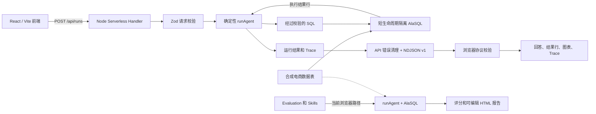

# 系统架构

BI Data Agent Sandbox 采用 React 前端加 Node Serverless 后端的混合架构。项目只使用仓库内的合成数据和确定性工作流。交互式运行会经过真实的请求与响应链路；Evaluation 和 Skills 当前仍在浏览器内复用同一套 Agent 核心。

## 运行拓扑

线上使用 Vercel 托管前端静态文件，并把 `api/runs.ts` 作为 Node Serverless Function。Vercel 会把 `/showcase` 等应用路由重写到 SPA，同时保留 `/api/runs` API Function。

本地开发和预览时，`src/dev/runApiMiddleware.ts` 会把同一个 Fetch 风格 Handler 适配到 Vite HTTP Server。`vite.config.ts` 会在 `npm run dev` 和 `npm run preview` 中都安装该插件。因此一个 Vite 进程即可同时提供前端和本地 API Adapter。

## 交互式运行链路

以下入口会通过 `src/agent/agentClient.ts` 调用 `POST /api/runs`：

- Retail Growth Demo 和 Experiment Metrics Demo 的 Topic 执行。
- Overview 页面中的 Quick Demo。
- `/showcase?view=agent`。
- `/showcase?view=guardrail`。

`api/_runRequest.ts` 只接受 JSON，请求体上限为 8 KiB，去除首尾空格后的问题最多 500 个字符，不接受未知字段，并且只允许两个可执行 Topic ID。

`api/runs.ts` 会生成服务端 Run ID、调用 `runAgent`、流式发送带版本的事件，并清理意外错误和 SQL 执行错误。传输格式是 `application/x-ndjson`，响应头包含 `X-Agent-Transport: ndjson-v1` 和 `X-Run-Id`。

事件顺序为：

1. `run.started`
2. 零个或多个 `step.completed`
3. 恰好一个 `run.completed` 或 `run.failed` 终态事件

项目不会人为 Sleep 或等待来制造过程感。时间由确定性工作实际运行时测量，因此较快的运行可能很快完成。

## 确定性 Agent 核心

`src/agent/runAgent.ts` 负责编排共享核心：

- `intentRouter.ts` 对已支持业务问题、未知问题和敏感请求进行分类。
- `metricCatalog.ts` 和 `schema.ts` 提供执行链路使用的公开语义上下文。
- `sqlGenerator.ts` 为已支持 Intent 选择确定性的只读 SQL 模板。
- `sqlValidator.ts` 会在执行前检查语句结构、已知表和字段、日期过滤、显式字段选择及敏感字段。
- `sqlExecutor.ts` 为每次运行创建独立的内存 AlaSQL 数据库，注册合成数据副本，执行通过校验的语句，并在结束后删除该数据库。
- `chartSpec.ts`、`answerGenerator.ts` 和 `trace.ts` 会生成图表数据、基于结果的回答、Warnings、Guardrail Decision、后续问题和可审查 Trace。

核心链路不调用模型，不读取网络数据源，也不需要 API key。可选 LLM 支持尚未实现。

`src/agent/knowledgeBase.ts` 和 `knowledge-base-demo` 只包含静态公开元数据。`runAgent` 不会读取这个模块，并且该 Topic 不能提交到 `/api/runs`。

## 浏览器信任边界

浏览器不会因为终态事件是合法 JSON 就直接接受它。`src/agent/agentClient.ts` 会校验：

- NDJSON Media Type 和传输协议版本。
- 响应头、起始事件、每个事件与终态 Run 的身份一致性。
- 严格递增的 Sequence 和终态事件位置。
- 整体响应、单行、事件、字符串、SQL、字段、数组和结果行的大小边界。
- Event、Trace、Result、Chart、Validation 和 Run 的允许结构。
- 流式 Trace Steps 与终态 Trace 的完全一致。
- 跨字段结果完整性，包括安全阻断和成功运行所需产物。

只有在事件流正常结束且全部终态校验通过后，完成事件才会暴露给 UI Callback。传输或协议错误会与业务运行本身返回 `failed` 状态区分展示。

## 当前执行位置

| 功能入口 | 执行位置 | 持久化 |
| --- | --- | --- |
| Topic、Quick Demo、Agent Showcase、Guardrail Showcase | Node/Vercel `/api/runs`；本地使用 Vite Adapter | 无 |
| Evaluation Dashboard 和 Evaluation Showcase | 浏览器 `runAgent` + AlaSQL | 结果和 Review Queue 只保存在浏览器状态 |
| Skill Runner | 浏览器 `runAgent` + Evaluation + AlaSQL | 可编辑报告只保存在浏览器状态；HTML 可以下载 |
| Knowledge Base Demo | 只展示元数据 | 无 |

报告预览使用沙箱化的 `srcDoc` iframe。生成的报告是独立 HTML，可以在下载前编辑。

## 数据和 Topics

`src/data/syntheticEcommerce.ts` 以确定性方式生成订单、流量、活动、商品、脱敏客户、退款和实验事件表。数据包含最新周不完整、收入下跌和退款率上升等受控场景，让准备好的问题能返回可检查结果。

`src/topics/topicCatalog.ts` 定义：

- `retail-growth-demo`：可执行，包含五个准备好的问题。
- `experiment-metrics-demo`：可执行，包含五个准备好的问题。
- `knowledge-base-demo`：只展示元数据，尚未实现运行时检索。

## 安全和质量

API 响应强制使用 `Cache-Control: no-store`、`Cross-Origin-Resource-Policy: same-origin` 和 `X-Content-Type-Options: nosniff`。Vercel 还会对站点强制启用 COOP、CORP、Permissions Policy、Referrer Policy、nosniff 和禁止页面被嵌入 Frame。

严格 CSP 当前通过 `Content-Security-Policy-Report-Only` 发送，尚未强制执行，因为 Evaluation 和 Skills 的浏览器端 AlaSQL 会动态编译查询。路线图会先把这两条路径迁到后端，再正式强制该策略；项目不会向策略中加入 `unsafe-eval`。

`.github/workflows/ci.yml` 使用 Node.js 24，并在推送到 `main` 和创建 Pull Request 时运行 `npm ci`、类型检查、测试、Lint 和构建。进程内契约测试会让生产客户端模块和 Parser 直接经过真实 API Handler，再把确定性结果与直接运行核心的结果进行比较；它不会启动浏览器或 HTTP Server。

## 当前限制

- 当前没有鉴权、分布式限流、持久化运行历史、持久化数据库或独立数据库服务、外部数仓、上传流程或第三方模型/数据 API。每次可执行运行都会创建短生命周期、相互隔离的内存 AlaSQL 数据库，并在结束后删除。
- 客户端取消会停止接收事件，但同步核心一旦开始服务端计算，就不能被真正抢占终止。
- Evaluation、Bad Case Review 状态、Skill Runner 产物和报告编辑内容都不会持久化。
- 前端主 Bundle 仍需要按功能拆分。
